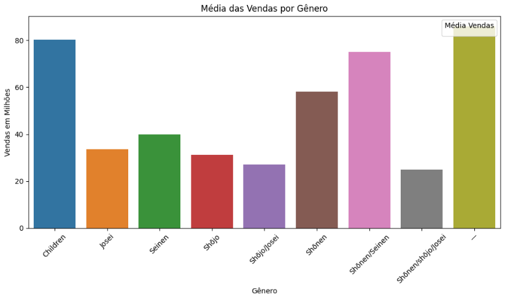
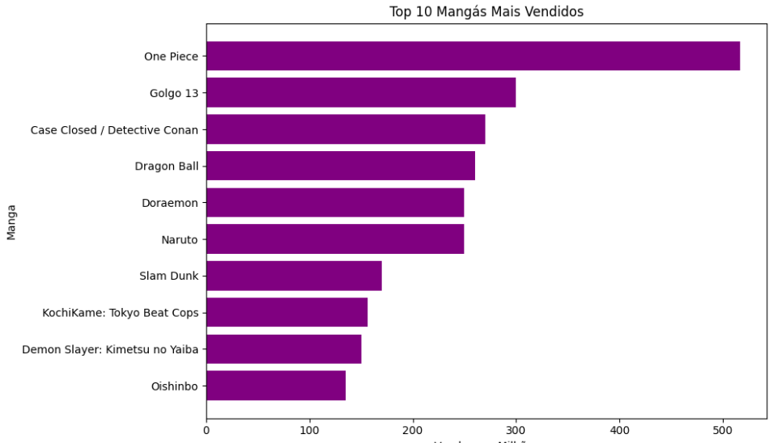
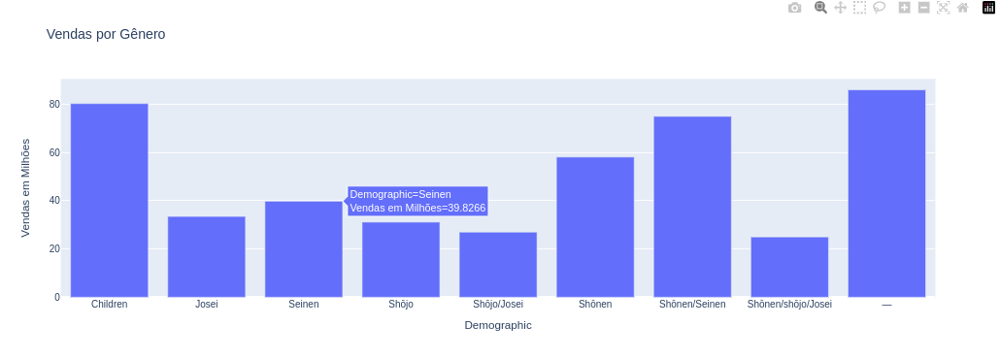
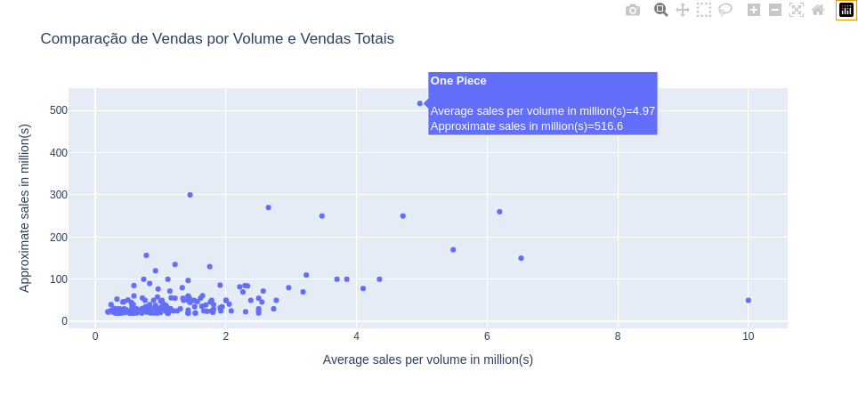

# Analise Interativa Mangas

Este projeto consiste em uma análise interativa dos dados de vendas de mangás  
Dataset 'best-selling-manga' feito por D RAHULSINGH no KAGGLE  
Link:https://www.kaggle.com/datasets/drahulsingh/best-selling-manga

-----------------
O projeto inclui as seguintes análises interativas:

### Gráficos Estáticos

1. *Média de Vendas por Gênero*

2. *Top 10 Mangás Mais Vendidos*

### Gráficos Interativos
Ao passar o mouse mostra informações detalhadas, e mais algumas funcionalidades

1. *Top 10 Mangás Mais Vendidos (Interativo)*

2. *Comparação de Vendas por Volume e Vendas Totais (Interativo)*

## Como Usar
Para utilizar as análises interativas, basta clonar este repositório e abrir os notebooks Jupyter fornecidos. Certifique-se de ter as bibliotecas necessárias instaladas para rodar os notebooks.

## Contribuição
Contribuições são bem-vindas! Sinta-se à livre para entrar em contato, com issues issues relatando problemas ou sugestões. Você também pode enviar pull requests com correções ou outras coisas que responderei.
